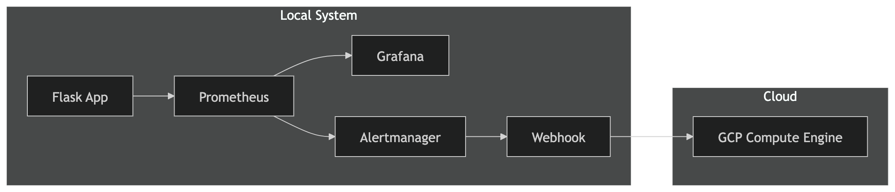

# Intelligent-Resource-Monitoring-Auto-Scaling-Pipeline
A hybrid cloud system that monitors local VM resource usage using Prometheus and automatically scales to Google Cloud Platform when CPU exceeds threshold.

## Overview

This project demonstrates a **fully automated cloud auto-scaling system** that monitors application traffic and dynamically provisions cloud infrastructure based on real-time demand.

The system uses **Prometheus for monitoring**, **Alertmanager for alert routing**, and a **custom webhook service** to trigger **Google Cloud VM creation**.

---

## Key Features

* Real-time monitoring using Prometheus
* Visualization with Grafana
* Alerting based on traffic spikes
* Automated scaling via webhook
* Dynamic VM provisioning on GCP
* Safety mechanisms (cooldown + lock)

---

## Architecture



---

## Tech Stack

* **Backend**: Python (Flask)
* **Monitoring**: Prometheus
* **Visualization**: Grafana
* **Alerting**: Alertmanager
* **Cloud**: Google Cloud Platform (Compute Engine)
* **Automation**: Python Webhook + gcloud CLI

---

## Project Structure

```
autoscaler-project/
│
├── app/                # Flask app with metrics
│   └── app.py
│
├── prometheus/
│   ├── prometheus.yml
│   └── alert.rules.yml
│
├── alertmanager/
│   └── alertmanager.yml
│
├── webhook/
│   └── app.py
│
├── grafana/
│   └── dashboard.json
│
├── start-all.sh        # Start all services
├── README.md
└── report/
```

---

## Setup Instructions

### 1. Start all services

```bash
chmod +x start-all.sh
./start-all.sh
```

---

### 2. Access services

| Service      | URL                           |
| ------------ | ----------------------------- |
| Flask App    | http://localhost:5000         |
| Metrics      | http://localhost:5000/metrics |
| Prometheus   | http://localhost:9090         |
| Alerts       | http://localhost:9090/alerts  |
| Alertmanager | http://localhost:9093         |
| Grafana      | http://localhost:3000         |
| Webhook      | http://localhost:5001         |

---

### 3. Configure Grafana

* Add Prometheus datasource: `http://localhost:9090`
* Create dashboard with:

```
rate(http_requests_total[1m])
```

---

## Testing the System

### Generate Load

```bash
ab -n 8000 -c 200 http://localhost:5000/
```

---

### Observe Flow

1. Traffic increases
2. Prometheus detects spike
3. Alert fires
4. Alertmanager triggers webhook
5. Webhook creates VM in GCP
6. New instance appears

---

## Safety Features

* **Cooldown mechanism** prevents rapid scaling
* **Lock file** avoids duplicate VM creation
* Timestamp-based instance naming

---

## GCP Integration

VM creation is triggered using:

```bash
gcloud compute instances create <instance-name>
```

Ensure:

* Compute Engine API is enabled
* Correct project is selected

---

## Concepts Covered

* Observability (metrics, monitoring)
* Auto-scaling systems
* Event-driven architecture
* Cloud computing (GCP)
* DevOps automation
* Infrastructure provisioning

---

## Final Notes

Built an end-to-end auto-scaling system using Prometheus, Alertmanager, and GCP that dynamically provisions compute instances based on real-time traffic metrics.

---

## Author

Gourav Garg

